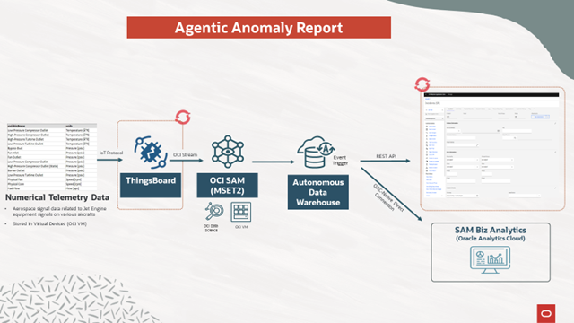

# Demo #2 (Agentic Anomaly Detection) Abstract
This workflow enables early detection of equipment anomalies through automated analysis of real-time telemetry data, reducing unplanned downtime and improving asset reliability. Detected issues are automatically logged as incidents, streamlining operational response and minimizing manual intervention. Integrated reporting combines system-generated alerts with user-submitted data to provide actionable insights for maintenance and engineering teams.

This demo illustrates how automated signal anomaly detection improves operational efficiency by proactively identifying equipment issues using OCI’s MSET2 engine and streaming IoT telemetry. By seamlessly integrating anomaly alerts into IBM Maximo through OCI services, the workflow eliminates manual data entry, accelerates incident response, and reduces downtime. The added analytics layer in Oracle Analytics Cloud enables real-time insights and strategic decision-making across engineering and maintenance teams.

  

# Demo Components
## 1. Demo Data Collection
## 2. ThingsBoard Deployment
## 3. OCI Object Storage + Stream Deployment
## 4. SAM Configuration
## 5. DB Trigger Deployment
## 6. IBM Maximo Data Configuration
## 7. SAMBA Deployment

# Demo Process Flow
