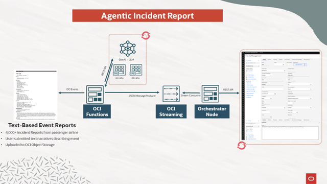

# Demo # 1 (Agentic Incident Report) Abstract
This workflow streamlines operations by transforming unstructured event reports into concise, actionable summaries using AI, enabling faster incident analysis and response. It reduces manual effort and ensures consistent, enterprise-wide asset management through automated data processing and system integration

This demo ingests unstructured, text-based event reports using Object Storage and triggers OCI Events to initiate processing. OCI Functions handle data cleansing and formatting, then invoke a Generative AI model (LLM) to summarize key incident details for easier analysis. The structured summaries are published via OCI Streaming and consumed by an orchestrator, which ensures reliable delivery to the enterprise asset management system. This automated pipeline reduces manual effort, accelerates response times, and standardizes incident reporting across the organization.

  

# Demo Components
## 1. Demo Data Collection
Step-by-Step Guide
    - https://github.com/HairyQ/Redhat-Summit/blob/8b812a542a54e7e4275b3834515aadda5bd76f77/Demo_1-GenAI/Step%201%3A%20Demo%20Data%20Collection.md

Downloadable Content
    - https://github.com/HairyQ/Redhat-Summit/tree/8b812a542a54e7e4275b3834515aadda5bd76f77/Demo_1-GenAI/Demo_Data
## 2. OpenShift Deployment

## 3. NVIDIA NIM Deployment (Llama Model)

## 4. OCI Event + Function + Stream Creation

## 5. Orchestrator Deployment

## 6. IBM Maximo Data Configuration

# Demo Steps
