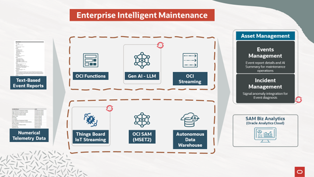

# AI-Powered Intelligent Maintenance Solution on OCI
(2025 Red Hat Summit Demo)

This demo showcases an end-to-end AI-enhanced incident and anomaly management workflow integrating Oracle Cloud Infrastructure (OCI), IBM Maximo, and open-source technologies. These core components are deployed on RedHat OpenShift in OCI, taking advantage of the flexible and scalable OpenShift technology from the public cloud to edge computing.

  - In the first phase, human-entered incident reports are ingested into OCI Object Storage, where OCI Functions and Llama3 generate concise summaries for maintenance teams. These are then mapped and pushed into IBM Maximo’s Events Management via REST API.

  - In the second phase, real-time aircraft telemetry data is streamed through ThingsBoard and analyzed using OCI’s MSET2 for anomaly detection. Identified anomalies are auto-logged into Maximo Incidents and correlated with human-entered Events Management from above.

  - Lastly, an integrated Oracle Analytics Cloud dashboard provides unified visualization of both user-reported events and telemetry-triggered incidents, alongside financial and operational impact analyses

